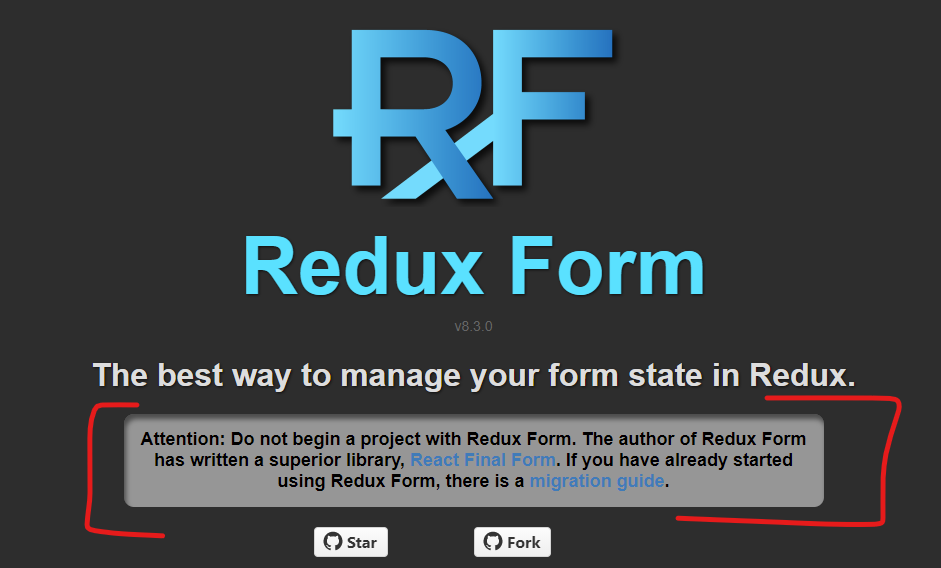

# Why not Redux Form?

_I'm gonna rag on Redux Form, but that in no way makes it a horrible library or a poor choice of a library; although, they'll tell you that themselves right on the homepage :p._

_The reason you choose a library is up to the needs of your team and your project. I would argue that OneForm is the one form library you need, but that's my opinion. You're free make these choices on your own ;\)._

### Introduction

Redux Form was the first major form library for React that I've ever known. It's so old that the designer went and built React Final Form as a competitor which still hasn't garnered the same popularity as the waning Redux Form. That's just how powerful this library was and still is today.

I think most people use Redux Form because they've already got Redux Form. Like the site says, don't use it unless you already have it:

### Dependence on global state

Redux Form utilizes and has a dependency on Redux. That means, if you ever choose to move away from Redux in your application, you're still stuck with it if you wanna use Redux Form.

If I were making this exact same library today, I'd hide the fact that it uses Redux and optionally allow people to hook into its internals. Heck, OneForm could be using Redux, MobX, or any other state manager, and you'd never know because it hides it all from you. This allows your application to not have a hard dependency on something brought in from a 3rd party library.

And since Redux Form depends on global state, it's like a tree with roots. You can't easily get rid of it.

### Keep form state local

I agree with them, form state is local. Hook into it as needed, but keep it local. This is why I consider OneForm a state-management library. Would _you_ mix Redux and some other state manager or would you keep them separate and only make connections between these two states where it makes sense?

I think Redux Form is a hard-lesson-learned in the React community. It wasn't more than a few years ago that Hooks and the new Context API took the React industry by storm. Now you can hardly find any Redux usage and most of it is siphoned off to thinks like user 

